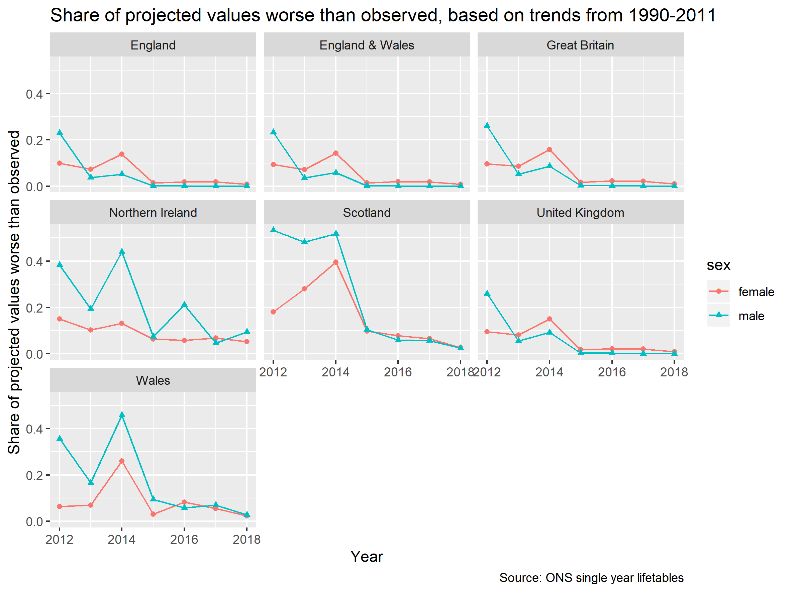

# Mortality Projections and Probability of Slowdown

This repository contains analysis of publically available mortality data on two linked research areas

* Projections of mortality in UK nations (and UK as a whole) up to and beyond 2012 based on trends in $e_0$ up to 2011
* Estimates of the likelihood there's been a slowdown in life expectancy from 2012 onwards given recent observations and past trends, and the relatively likelihood of different proposed magnitudes of decline

This statement needs to be reviewed and accepted

Here is a link to an intro to [markdown](https://github.com/adam-p/markdown-here/wiki/Markdown-Cheatsheet)

## Figures 

Here is a figure from within the repo

